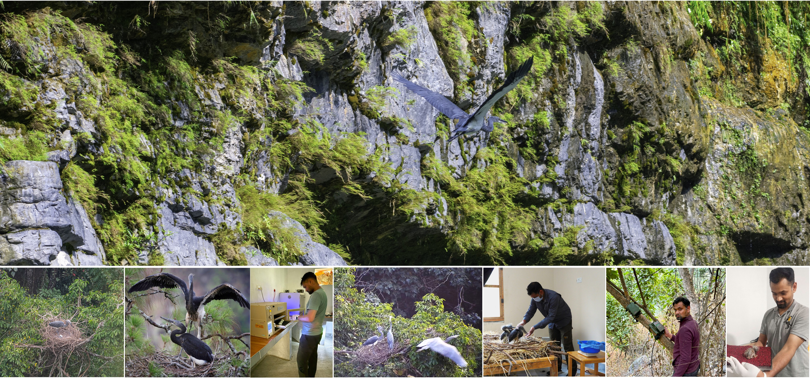
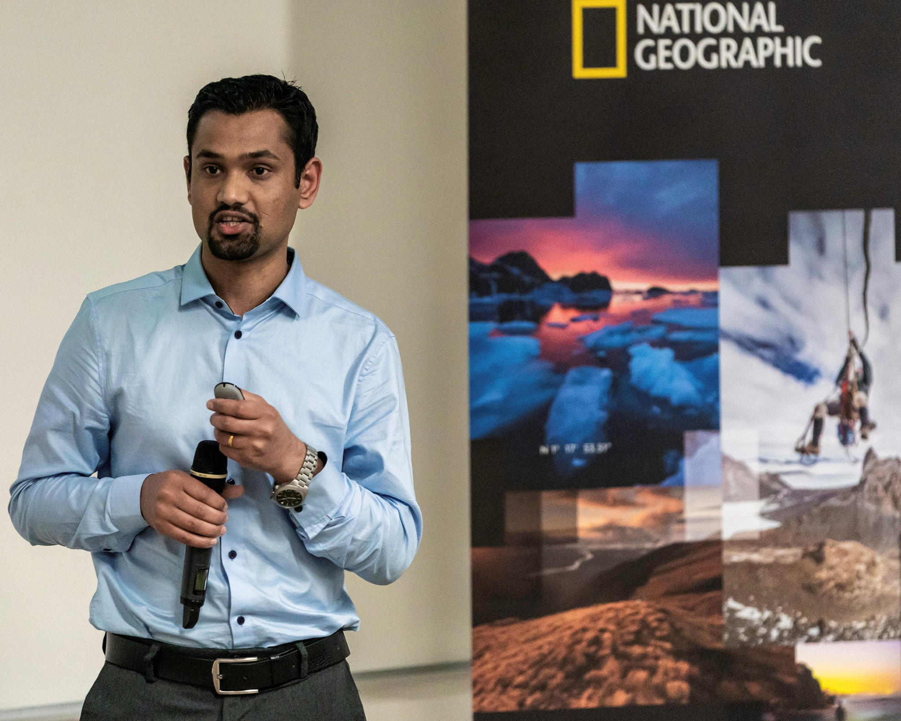

```{=html}
<div class="hero-banner">
  
</div>

<div class="home-grid">
  <div>
    <div class="profile-photo">
      
    </div>
  </div>

  <div>
    <h1 class="home-name">Indra P. Acharja</h1>
    <div class="home-title">
      Doctoral Candidate | Texas State University, San Marcos, TX<br>
      Research Assistant, Clay Green's Lab | Department of Biology
    </div>

    <p>
      <span class="welcome-word">Welcome!</span> I am a conservation biologist and doctoral student at Texas State University, 
      where my research focuses on the ecology and biology of the <em>critically endangered</em> 
      White-bellied Heron (<em>Ardea insignis</em>) — the world's rarest heron, 
      with fewer than 60 individuals remaining in the wild.
    </p>
    <p>
      My work combines field ecology, remote nest monitoring, habitat assessment, and conservation breeding to understand and reverse this species' decline across its Himalayan range in Bhutan, India, and Myanmar.
Before joining Texas State, I served at the Royal Society for Protection of Nature in Bhutan — first as Project Officer and later as Chief Conservation Officer — where I led the establishment of the White-bellied Heron Conservation Center, home to the world's first ex-situ population of this species, and helped secure an endowment of over $3 million for its future.
    </p>
    <p>
      I hold an MFS from Yale University and an M.Sc. from the Forest Research Institute (Deemed) University, India.
    </p>

    <div class="contact-links">
      <a href="mailto:indra.acharja@gmail.com">✉ indra.acharja@gmail.com</a>
      <span class="contact-sep">·</span>
      <a href="https://scholar.google.com/citations?hl=en&user=81ZJUakAAAAJ" target="_blank">Google Scholar</a>
      <span class="contact-sep">·</span>
      <a href="https://www.researchgate.net/profile/Indra-Acharja" target="_blank">ResearchGate</a>
      <span class="contact-sep">·</span>
      <a href="https://www.linkedin.com/in/indraacharja" target="_blank">LinkedIn</a>
    </div>
  </div>
</div>

<div class="stat-strip">
  <div class="stat-item">
    <span class="stat-num">15+</span>
    <span class="stat-lbl">Publications</span>
  </div>
  <div class="stat-item">
    <span class="stat-num">10+</span>
    <span class="stat-lbl">Years WBH research</span>
  </div>
  <div class="stat-item">
    <span class="stat-num">&lt;60</span>
    <span class="stat-lbl">WBH left in wild</span>
  </div>
  <div class="stat-item">
    <span class="stat-num">&lt;5</span>
    <span class="stat-lbl">WBH active nests in wild</span>
  </div>
</div>

<div class="affil-section">
  <h3>Affiliations &amp; Memberships</h3>
  <div class="affil-tags">
    <span class="affil-tag">Texas State University</span>
    <span class="affil-tag">Yale University (MFS, 2019)</span>
    <span class="affil-tag">National Geographic Explorer</span>
    <span class="affil-tag">IUCN SSC Heron Specialist Group</span>
    <span class="affil-tag">White-bellied Heron Working Group</span>
    <span class="affil-tag">Waterbird Society — Student Councilor (2026–27)</span>
    <span class="affil-tag">Royal Society for Protection of Nature, Bhutan</span>
  </div>
</div>
```
