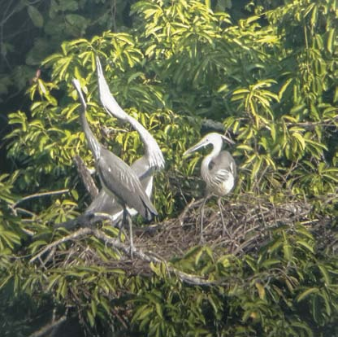
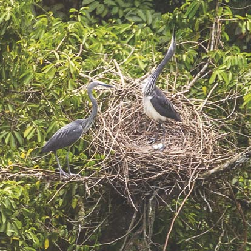

It was a cold January morning in 2020 when our local observer at Tsidang sent a message that would set the tone for one of the most unsettling breeding seasons we had ever monitored. Several White-bellied Herons were gathered at an old nest site, rebuilding together. That alone was unusual. What followed would take us months to fully process.

The observations we made over the next four months — published in *BirdingASIA* — represent the first documented case of sexual conflict, parental infanticide, and unusually prolonged incubation failure in the White-bellied Heron. For a species with fewer than 60 individuals left in the wild, every nest matters. This one taught us something we had never expected.

## A nest, and an unwelcome guest

We arrived on 23 January to find four adult herons actively rebuilding an old nest along the Mangdechhu River in central Bhutan. Within a week, one bird disappeared, leaving three — what we came to interpret, through careful behavioural observation, as a bonded pair and an intruder.

The White-bellied Heron is sexually monomorphic: male and female look identical. We cannot tell them apart by sight. But behaviour told a story. Two birds — the presumed male and female — took turns incubating. The third followed closely, hovered near the nest, brought nesting material, and seemed unable to leave.

::: {style="float: right; margin: 0 0 1.2rem 2rem; max-width: 340px;"}

:::

This is not normal. In all our years of monitoring White-bellied Herons, once a pair bonds, unpaired individuals leave. The nest becomes the exclusive territory of two birds. Not here. The third bird remained through weeks of incubation, returning day after day, bringing sticks and calling, as if making a case for its own inclusion.

Every time this intruder approached, the incubating bird would stand, call loudly, and remain on alert until it had left. It was a constant, low-level disruption — not violent, not decisive, just unresolved. The pair never drove the intruder away. The intruder never gave up. We have no satisfying explanation for why the stand-off persisted as long as it did.

The first egg was laid on 11 February. By 15 February, there was a clutch of three.

## 33 days of incubation — and then one chick

On 15 March, after 33 days of incubation, one egg hatched. It was a moment that always feels significant when monitoring a species this rare: another White-bellied Heron had entered the world. The remaining two eggs continued to be incubated, and we waited for more hatchlings.

They never came.

Four days passed. Then a week. Then two. The chick was there, growing, visible through our spotting scopes from 300 metres across the river. But the parents kept incubating the remaining eggs rather than shifting fully to brooding and feeding the chick.

::: {style="float: left; margin: 0 2rem 1.2rem 0; max-width: 340px;"}

:::

Then, on 19 March, four days after hatching, we witnessed something we had never seen before. One of the pair returned to the nest for an incubation exchange. Its mate immediately left to feed downstream. The intruder was not present that day. The parent at the nest did not feed the chick. It sat as usual, brooding. We could see the chick clearly — moving, alive, four days old.

After 30 minutes, the chick moved and peeked out from the side of the nest. The parent stood up. And then it attacked its own chick.

After several strikes, the parent picked the chick up and threw it to the edge of the nest. The chick tried to climb back. The parent threw it off entirely. Then it returned to incubating the unhatched eggs.

The chick became entangled on a branch below the nest and eventually fell into the bush beneath the nest tree. It did not survive.

## What does this mean?

We do not know with certainty why this happened. We could not identify which individual killed the chick — the male, female, or the intruder (who was absent that day, but whose prior presence may have contributed to the stress on the pair). We could not determine whether this was an act driven by sexual conflict, resource scarcity, or something else entirely.

What we can say is that it is deeply unusual. Brood reduction in herons — where siblings compete and the weakest perishes — is well documented. Parental infanticide is far rarer, and the cases in the literature involve specific, understood pressures. Here, the parent appeared to choose to continue incubating eggs that would never hatch, over brooding a living chick. That inversion of parental logic remains unexplained.

The incubation continued for another six weeks. On 29 April — 45 days after the first egg hatched — one of the remaining eggs was missing. On 2 May, one parent was still sitting on the nest. The following morning, the nest was empty and abandoned. The total incubation period had stretched to 79 days — more than twice what is normal.

## A pattern we had missed

Looking back at 2019, when we had monitored the same nest only weekly, the sequence was eerily similar. One egg hatched in April; a week later the chick was gone; by May the nest was empty. We had noted the failure and moved on. The 2020 observations gave us reason to suspect the same thing had happened the year before — and that we had not been watching closely enough to see it.

## Why this matters

A species with fewer than 60 individuals surviving in the wild has no room for wasted breeding seasons. When a nest fails before eggs are laid, the pair often rebuilds and tries again. When it fails during incubation through predation or storm damage, the same. But this nest absorbed months of parental effort — courtship, nest construction, incubation, the early days of raising a chick — and produced nothing. Twice in succession.

We cannot extrapolate from a single nest. But the question lingers: how often does this happen in nests we are not watching? How much of the White-bellied Heron's recruitment failure reflects not just habitat loss or human disturbance, but this kind of cryptic breeding dysfunction?

We published these observations not because we have answers, but because they exist — because they happened, and they should be part of the record. The behaviours we witnessed at the Tsidang nest are now the baseline for what is possible in this species. That knowledge will shape how we monitor, what we look for, and what questions we ask next.

Surveillance cameras now watch these nests through the season. One day, we may understand what we saw.

---

*The full study — "First observation of sexual conflict and parental infanticide in the Critically Endangered White-bellied Heron* Ardea insignis*" — is published in* BirdingASIA 35 *(2021): 38–42.*

*Authors: Indra P. Acharja, Sonam Tshering, Tshewang Lhendup & Thinley Phuntsho. Photographs by Thinley Phuntsho.*
