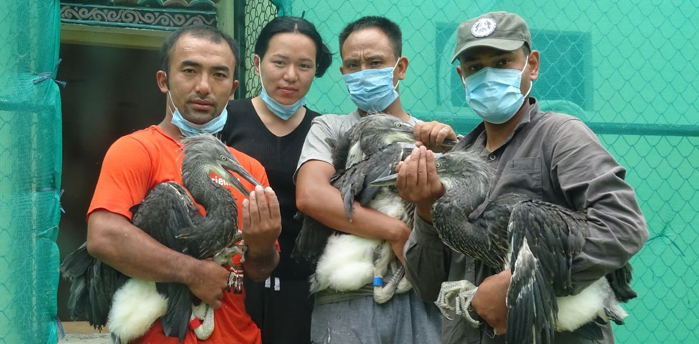
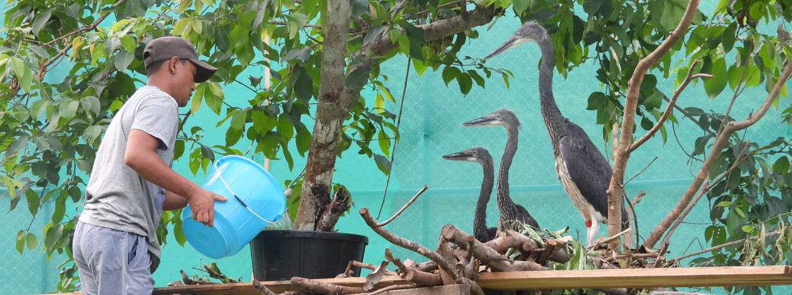

::: {style="margin: 2rem 0;"}

:::

For a species with fewer than 60 individuals left in the wild, every bird matters. And for the first time, in 2021, three of those birds came to live not on a cliff-hanging nest above a Bhutanese river, but in a purpose-built facility designed to give them — and their species — a future beyond what the wild alone can guarantee.

The White-bellied Heron Conservation Center (WBH-CC), established by the Royal Society for Protection of Nature (RSPN) at Chachey Dovan in Tsirang district, is the world's first permanent structure dedicated to the conservation breeding and recovery of the critically endangered White-bellied Heron. This is the story of its first year.

## Why a conservation center?

Wild populations of the White-bellied Heron face threats that are structural and worsening — habitat degradation, hydropower development, and the fundamental vulnerability of a species so rare that a single bad breeding season can measurably reduce global numbers. In-situ conservation: protecting nests, monitoring breeding pairs, managing disturbance, is necessary but not sufficient.

A captive population provides something the wild cannot: insurance. The WBH-CC was built to secure a living gene pool outside the wild, raise birds that can be bred and eventually released into safe habitats, and serve as a global research and information hub for the species.

The center was constructed with support from the Royal Government of Bhutan, the Department of Forests and Park Services, and Punatsangchhu Hydroelectric Project Authority (PHPA I & II). Operational costs are met from the White-bellied Heron Endowment Fund, supported by the Mava Foundation.

## Collecting the first chicks

On 4 April 2021, all four eggs at the Rilangthang nest — a site in regular use since 2018 — hatched successfully. It was the first time a complete clutch had hatched in four years. The team at the WBH-CC, located 15 km from the nest, was already preparing.

The timing of collection was deliberate and narrow. Wait too long, and the parents would begin the natural process of brood reduction — the weakest chick discarded or killed by siblings. The window was brief: chicks six to eleven days old, still small enough to be transported safely, still young enough to adapt to hand-rearing.

On 11 April, at 5:30 AM, the team set out. After a 30-minute drive and a 45-minute descent down a cliff, they arrived at the Punatsangchhu riverbank with rafting equipment. The nest was on the opposite bank. The team crossed by raft, walked to the nest tree — a thin, thorny-climber-covered broadleaf species unlike anything they had expected from binocular distance — and one team member, abandoning the climbing gear, ascended barefoot. He placed the chicks in a collecting bag and made his way back down.

The rule: leave one, collect the rest. All four chicks were alive. Three were collected — the healthiest three — and one remained in the nest with its parents. That lone chick was successfully raised and fledged 71 days later.

::: {style="margin: 2rem 0;"}

:::

By 9:45 AM the team was back at the center. The chicks were placed in an artificial nest, allowed to settle, weighed, and measured. The smallest weighed under 80 g; the largest over 500 g. Two hours later they were fed fresh fish — by hand — for the first time.

## Hand-raising: learning as we went

The team had no precedent. No one had hand-raised a White-bellied Heron before. The questions were immediate and practical: how to hold them without causing stress? Live fish, dead, or half-dead? How warm should feeding be? How many times a day? What temperature? What about humidity, sun exposure, disease transmission?

COVID-19 made it impossible to bring international experts in person. Instead, a WhatsApp group was formed with advisors from Prague Zoo, Zlin Zoo, and other institutions — Dr. Helena Vaidl, Mr. Roman Horsky, Mr. Antonin Vaidl, Mrs. Catherine E. King, Mrs. Gemma Goodman, Dr. George Archibald, among others. Any uncertainty, any unusual behaviour, any health concern was messaged immediately. The answers came back. It worked.

For 36 days, the chicks were raised in a temperature- and humidity-regulated laboratory, in an artificial nest made of dried branches and twigs. Weights were recorded daily for five weeks. Tarsus, beak, wing, and toe measurements were taken weekly. Fish were fed with vitamin and probiotic supplements to ensure balanced nutrition.

## Into the aviary

When the chicks were 46–48 days old they were transferred to the outdoor aviary — a larger space with natural shade trees, perching branches, rocks, and a stream with live fish. The change was immediate. The chicks walked, jumped, preened, flapped, called. By 58 days they were perching on branches. By 65 days they were taking short flights. By 72 days — the age they would have fledged in the wild — they were flying between perches and descending to the fishpond.

::: {style="margin: 2rem 0;"}

:::

## A loss — and a lesson

On 10 June, the keepers arrived for the morning round to find all three chicks on the ground. The two elder birds (named Red and Blue after their leg-band colours) had been exploring the ground for days. But the youngest — Yellow — was lying near the nest tree, unable to raise its head, making short continuous calls.

There were no visible injuries. The veterinary doctor at Prague Zoo was contacted immediately. Internal injuries were suspected. By 6:45 AM, Yellow was dead. A post-mortem confirmed fractured cervical vertebrae, fractures at the fibula of the right leg, and internal bleeding — almost certainly from a failed first landing after an early flight attempt.

The probable cause: confined to a smaller space than the wild, Yellow had watched its siblings move freely and was provoked to attempt flight before it was ready. The nest was 1.8 metres high — easy to launch from, but no room to manoeuvre and land safely.

Changes were made immediately: the nest height was lowered, and a protocol was established to separate younger chicks from their fledged siblings during the critical transition window. The loss was hard. But it taught the team something that will protect every chick that follows.

## Sex, health, and fish

Molecular sexing — conducted with support from the National Museum of Nature and Science in Tokyo — confirmed that the two surviving birds were one male and one female. A first breeding pair in captivity.

Health monitoring is conducted daily. Dropped feathers are collected each morning and screened for parasites. Faecal samples are sent quarterly to the veterinary hospital in Damphu for intestinal parasite screening. As of the report date, no parasites had been detected.

Feeding is a significant logistical challenge. White-bellied Herons eat fish and only fish. Each bird receives around 300 g per day supplemented by whatever they catch themselves in the aviary pond. With no commercial fisheries in Bhutan, the center raises its own — currently capacity for 15,000 fingerlings — and buys locally where possible. As the captive population grows, fish supply will be one of the most pressing operational constraints.

## What comes next

The two birds now in the aviary are the beginning. The plan is to build the captive population to up to 50 individuals through continued collection of wild-born chicks — always leaving one in the nest, always working within the window where collection does the least harm and offers the greatest benefit. Each collected bird will be genetically distinct, expanding the diversity of the founders.

To reach that scale, the center needs more aviaries, more fishponds, more staff, and sustained funding. Approximately **US$150,000 per year** is required to support White-bellied Heron conservation work in Bhutan, a figure that will rise as the center reaches full capacity. Currently only half the operational cost is covered by the WBH Endowment Fund. A conservation action plan for the species has been developed to guide the next ten years — but significant financial gaps remain.

The first year was about learning. The second will be about building.

---

*The full report — "The White-bellied Heron Conservation Center" — is published by the Royal Society for Protection of Nature (December 2021) and is freely available at [rspnbhutan.org](https://rspnbhutan.org/downloads/2621/).*
