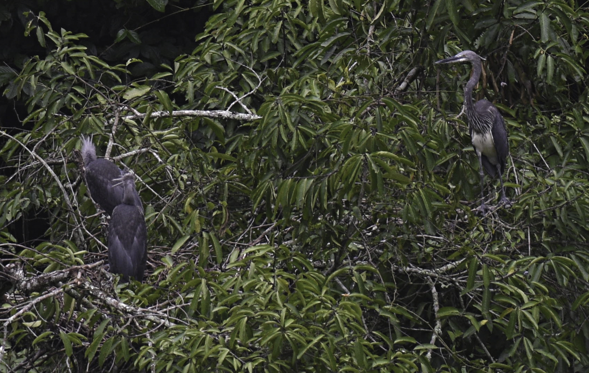

::: {style="margin: 2rem 0;"}

:::

There are fewer than 60 White-bellied Herons left on Earth. Not fewer than 60 in Bhutan — fewer than 60 anywhere: across the entire range of the species, from Bhutan and India to Myanmar and Bangladesh. Of those, roughly 25 to 30 live and breed in Bhutan — about 40 percent of the global population, concentrated along three river systems in the country's south and centre.

That number alone should tell you everything about the stakes. But a number, however alarming, does not by itself protect a bird. What it needs is a plan — specific actions, assigned responsibilities, clear targets, and real money behind them. In 2022, the Royal Society for Protection of Nature (RSPN), in partnership with the Department of Forests and Park Services, published exactly that: the White-bellied Heron Conservation Action Plan 2022–2031.

## What the plan sets out to do

The vision is straightforward: a viable, self-sustaining White-bellied Heron population living in healthy, protected riverine ecosystems. The goal by 2031 is measurable — at least 25 breeding pairs in the wild, and at least 50 individuals in the captive breeding programme at the WBH Conservation Center.

Both targets matter. The wild target means growing and stabilising a population that has been slipping. The captive target means building an insurance population — birds that can be bred, studied, and eventually returned to safe habitats if the wild situation worsens.

## Why the species is still declining

::: {style="float: right; margin: 0 0 1.2rem 2rem; max-width: 360px;"}

:::

The action plan is honest about what is driving the decline. Hydropower development has altered the rivers the herons depend on — changing flow regimes, submerging feeding areas, and fragmenting the long stretches of undisturbed gravel bank and shallow water that the birds need to hunt. Sand and gravel extraction from riverbeds continues at nest sites and feeding grounds. Human disturbance during the breeding season — from settlements, livestock, and activity near nest trees — causes nest abandonment. And climate change is beginning to shift monsoon patterns and river behaviour in ways that are hard to predict but unlikely to help.

None of these pressures are easy to reverse. But the plan identifies where action is both possible and most needed.

## Six things the plan commits to

The action plan organises its response around six strategic objectives:

**1. Protecting and restoring habitat.** Formal protection for key nesting and feeding areas, buffer zones around active nest sites, and restoration of degraded riverine vegetation along priority reaches.

**2. Reducing threats at the nest.** Restricting sand and gravel extraction near active nests, establishing seasonal exclusion zones, and working with hydropower authorities to manage flows during the breeding season.

**3. Building the captive population.** Expanding the WBH Conservation Center to hold up to 50 individuals, developing breeding protocols, and preparing for eventual release of captive-bred birds into the wild.

**4. Research and monitoring.** Annual population surveys across all known sites, nest cameras, genetic sampling, and collaborative research with international institutions to fill critical knowledge gaps.

**5. Engaging communities.** Involving local communities near nest sites in monitoring and protection, developing livelihood alternatives where traditional activities conflict with conservation, and building long-term local ownership of the species' future.

**6. International cooperation.** Coordinating with range countries — India, Myanmar, Bangladesh — to share data, harmonise survey methods, and develop a transboundary picture of the species' status.

## What it costs — and what the gap looks like

::: {style="margin: 2rem 0;"}

:::

Implementing the plan over ten years requires approximately Nu. 370 million — roughly US$3.4 million. That is not a large number in conservation terms. But currently, only a fraction of that is covered. The White-bellied Heron Endowment Fund, supported by the Mava Foundation, covers core operational costs at the Conservation Center. Broader habitat protection, community engagement, and research work remain underfunded.

The gap is not a reason to doubt the plan. It is a reason to close it.

## Why this matters beyond the heron

The White-bellied Heron is what conservation biologists call an umbrella species — protecting it requires protecting the broader riverine ecosystem it depends on. The gravel bars, the clean shallow water, the old riparian forest, the undisturbed nesting trees: these are not only good for herons. They are good for macroinvertebrates, for fish communities, for water quality, for the dozens of other species that share the same river corridors. A plan to save the heron is, in effect, a plan to keep these rivers alive.

Bhutan has the political will and the institutional infrastructure to make this work. The action plan is not aspirational — it is operational. What it needs now is implementation.

---

*The White-bellied Heron Conservation Action Plan 2022–2031 is published by RSPN and the Department of Forests and Park Services, Bhutan, and is freely available at [rspnbhutan.org](https://rspnbhutan.org/downloads/2559/).*
