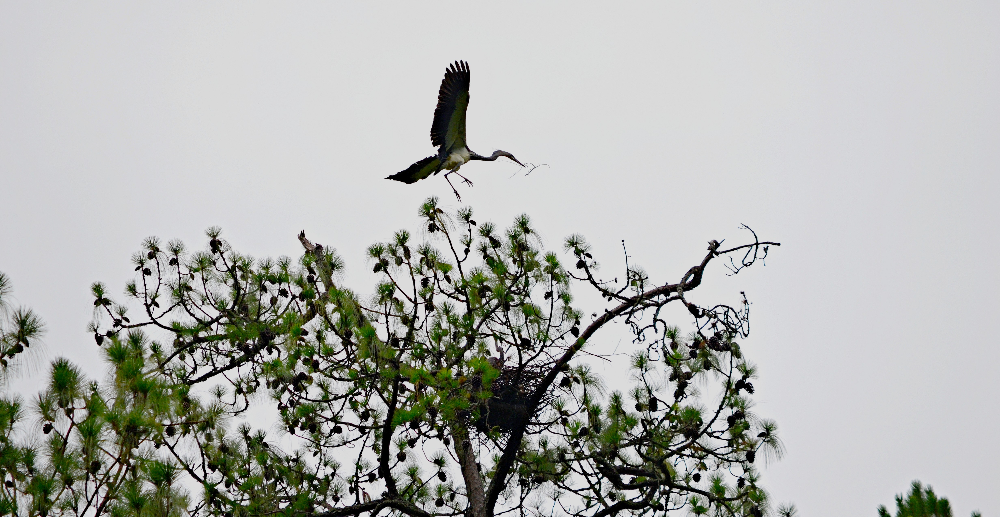
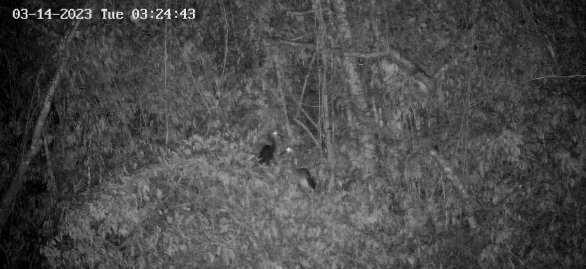
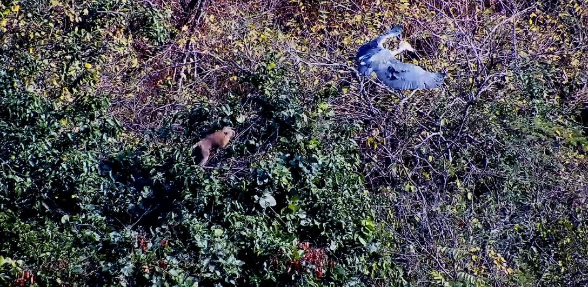
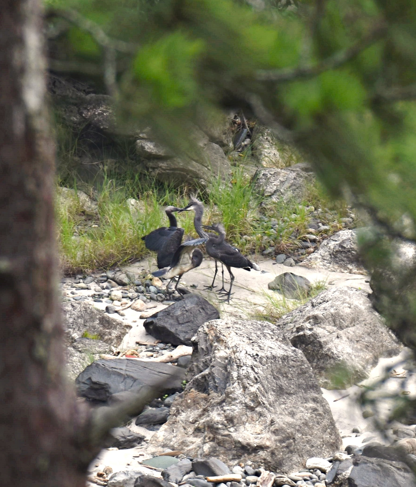

High on the banks of the Punatsangchhu River in Bhutan, in a tall tree overhanging fast-moving water, a pair of herons is building a nest. They have used this same tree, in this same stretch of river, for years. If you were walking below, you might not notice them at all — they are silent, still, and almost impossibly well-hidden for birds that stand nearly a metre tall.

These are White-bellied Herons. There are fewer than 60 of them left in the world.

For the past ten years, my colleagues and I have been watching those nests — carefully, quietly, and from a respectful distance. What we have learned is the subject of a new study just published in the journal *Ornithology*. The findings are sobering.

## What we did — and why nests matter

We monitored every known active White-bellied Heron nest in Bhutan between 2016 and 2025. Every few days during the breeding season, we checked in — recording when eggs were laid, how many hatched, how many chicks survived to fly, and what went wrong when they did not. We also deployed remote cameras at nest sites so we could observe behaviour without disturbing the birds.

::: {style="float: right; margin: 0 0 1.2rem 2rem; max-width: 340px;"}

:::

::: {style="margin: 2rem 0;"}

:::

For a species this rare, every nest is critically important. With only three or four breeding pairs in the entire country — and Bhutan holding the largest known population in the world — the output of those nests is not just a number. It is the species' future.

## The uncomfortable truth about timing

One of the clearest patterns we found concerns timing. White-bellied Herons that begin nesting in February or March — the natural peak of the breeding season — have a reasonable chance of success. Pairs that laid their first eggs in February succeeded **58% of the time**. March nesters did even better at **69%**.

But as the season stretches later, something goes wrong. April nests succeeded only **one in five times**. Nests started in May or June? Every single one failed.

The problem is that over our ten years of monitoring, breeding is becoming less predictable. The window of time between the earliest and latest nesting attempts has widened considerably. Some pairs are starting later than they ever did before. And late starts, our data shows, are almost always a death sentence for that year's breeding attempt.

## No second chances

Perhaps the most striking finding in our study is this: in every case where a pair lost their eggs or chicks and tried again — what ecologists call a "replacement clutch" — the second attempt also failed. Every time. Not once in ten years did a pair successfully raise chicks after losing their first nest.

For most birds, the ability to re-nest after failure is a crucial safety net. For the White-bellied Heron, that net does not exist. Each breeding season is effectively a single opportunity, and when it is lost, it is lost entirely.

## What is going wrong at the nests?

Nests failed for a range of reasons. Predators — including monkeys and small carnivores — were responsible for some losses. Severe weather damaged nests and eggs. Human disturbance played a role. In a handful of deeply unusual cases, we documented parental infanticide — a behaviour that has been recorded only rarely in herons and speaks to the extraordinary stress these birds face.

::: {style="margin: 2rem 0;"}

:::

Nearly half of all monitored nests — 45% — failed before producing fledglings.

## Why this matters beyond Bhutan

The White-bellied Heron is found in Bhutan, India, and Myanmar. Its total global population is smaller than most village communities. It depends on clean, undisturbed Himalayan rivers — exactly the kind of habitat facing the most intense pressure from hydropower development, deforestation, and human encroachment across its range.

Our study shows that even in Bhutan, where the species has the strongest protections and the most active conservation programme, the birds are struggling to reproduce reliably. Across the wider range, conditions are considerably worse.

A population this small cannot absorb sustained breeding failure. When fewer chicks are raised each year than adults are lost, the numbers fall — slowly at first, then rapidly. The mathematics of small-population biology are unforgiving.

## There is still time — but not much

The White-bellied Heron has not disappeared yet. Pairs are still nesting, still raising some chicks, still returning to the same rivers year after year with the kind of fidelity that speaks to a deep, evolved connection to place.

::: {style="float: left; margin: 0 2rem 1.2rem 0; max-width: 300px;"}

:::

But the margin is narrowing. Our data suggest that without active intervention — protecting nesting sites from disturbance, understanding and addressing the drivers of late and failed breeding, and maintaining the ex-situ population as an insurance against catastrophic loss — the wild population may not be able to sustain itself.

Ten years of watching these nests has convinced me that the White-bellied Heron is one of the most extraordinary birds on earth. It has also convinced me that it will not survive on good intentions alone.

---

*The full study — "Increasing variability and declining breeding success: A major challenge in the conservation of the critically endangered* Ardea insignis *(White-bellied Heron)" — is published in* Ornithology *and is available at [doi.org/10.1093/ornithology/ukag017](https://doi.org/10.1093/ornithology/ukag017).*

*Authors: Indra Acharja, M. Clay Green, Yuji Okahisa, Thinley Phuntsho, Tshering Tobgay, Pema Khandu, Satoshi Shimano.*
