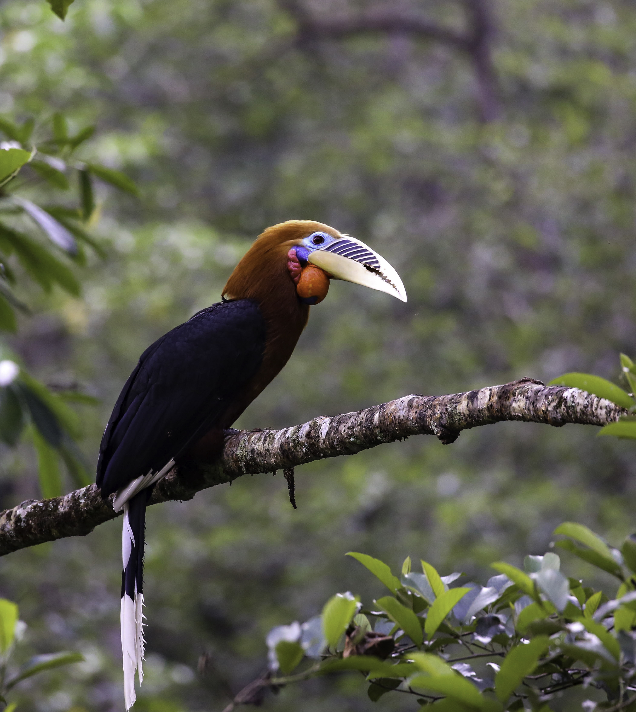

There is a bird in Bhutan that almost no one has ever seen. It stands nearly a metre tall, hunts in fast-moving Himalayan rivers, and has been listed as Critically Endangered since 2007. Its global population — spread across Bhutan, a thin strip of northeastern India, and an uncertain fragment in Myanmar — numbers fewer than sixty individuals. More than half of them live in Bhutan.

The White-bellied Heron (*Ardea insignis*) is one of the rarest birds on the planet. And for the past twenty-three years, the Royal Society for Protection of Nature has been counting every individual it can find.

::: {style="margin: 2rem 0;"}

:::

What began in 2003 as a modest attempt to document where these herons lived has grown into one of the most consistent wildlife monitoring programmes in the eastern Himalayas. Each year, from late February to early March, more than eighty surveyors fan out across Bhutan's major river systems — walking riverbanks, scanning riverine forests, watching confluences at dawn and dusk — recording every heron they see. And every other creature they see alongside it.

The cumulative result of those surveys is something remarkable: not just a population census of one extraordinarily rare bird, but an ongoing portrait of the ecological richness of Bhutan's river corridors. It is a portrait that tells us something important about what these rivers are, what they contain, and what we stand to lose if we do not protect them.

## A species on the edge — and the data to prove it

When the first systematic survey was conducted in 2003, fourteen White-bellied Herons were recorded. All of them were in two river basins: the Punatsangchhu and its upper tributaries.

In the years that followed, the count fluctuated. It rose steadily through the mid-2000s, reaching a recorded peak of thirty individuals in 2008 and 2009. Then came a long, uncomfortable decline. By 2021, only twenty-two herons were found in the entire country — five fewer than the year before, with the sharpest losses in the upper Punatsangchhu basin. Rivers like the Phochu, Mochhu, Adha, and Harachhu — once the heron's most reliably occupied habitats in Bhutan — had grown quiet.

The reasons for that decline are not difficult to identify. The surveys document them, too: infrastructure development along riverbanks, hydropower construction, agricultural encroachment, increasing recreational activity in previously undisturbed valleys, diminishing fish populations, and the slow, steady loss of the undisturbed forested riparian habitat the heron depends on. In the 2022 survey alone, surveyors recorded threats — ranging from road construction and sand extraction to cattle grazing and illegal fishing — at more than 438 locations across the surveyed river network. This is not a bird under pressure from one or two discrete problems. It is a bird facing the cumulative weight of a changing landscape.

The picture, though, is not one of unrelenting decline. The same surveys show something encouraging happening in the middle reaches of the Punatsangchhu, in the Mangdechhu basin, and more recently in rivers that had rarely or never recorded herons before. The 2023 survey counted twenty-four wild individuals and, for the first time, recorded four herons in the Wangchhu basin. In 2026, twenty-six wild herons were recorded across ten rivers and tributaries — the highest wild count since surveys began. Five active nests were found in a single breeding season, a record matched only once before, in 2013.

Add in the five individuals currently held in the White-bellied Heron Conservation Centre — which RSPN established in 2021 as an insurance policy against catastrophic loss — and the known Bhutan population stands at thirty-one. That is the highest total figure ever recorded.

It would be easy to read this as a conservation success story and stop there. It is not that simple. The population remains critically small, and breeding success is fragile. Our recent research, published in *Ornithology*, found that nearly half of all monitored nests failed before producing fledglings, and that no pair has ever successfully raised chicks after losing a first clutch. The mathematics of a population this small are unforgiving. But the direction of travel, for now, is cautiously hopeful.

What has changed is where the herons are being found. Two decades ago, the surveys covered forty to fifty zones concentrated in the Punatsangchhu and Mangdechhu basins. Today, the same methodology covers eighteen zones spanning the full extent of Bhutan's known and potential heron habitat — from the subtropical river valleys in the south, at around 150 metres above sea level, to rocky upper gorges approaching 1,800 metres. Herons are now being recorded in the Wangchhu, in the Jigmechhu, in the Phibsoo Wildlife Sanctuary, and most recently in the Kanamakurachhu within Royal Manas National Park — a location where a heron had never been recorded until December 2025. The range is not shrinking. In some ways, it is expanding, or perhaps returning.

## What the surveys found alongside the heron

Here is the thing about counting a rare bird for twenty years in some of the richest river valleys on earth: you end up counting a great deal more than one species.

From the earliest surveys, all bird species observed were recorded alongside the heron data. As the methodology matured, mammals were systematically documented too. The result is a dataset of extraordinary ecological breadth — not from dedicated biodiversity surveys with standardised transects and exhaustive protocols, but from the incidental observations of experienced field workers spending five consecutive days in some of Bhutan's most productive wild places.

The numbers, even conservatively, are striking.

The 2022 survey — which covered more than 600 kilometres of river in four major basins — recorded 244 bird species and 20 mammal species. The following year, across 565 kilometres of riverscape, 271 bird species and 23 mammal species were documented. By 2024, the total had reached 207 bird species and 18 mammal species. And in 2026, more than 300 bird species were identified in a single five-day survey, alongside 22 mammal species.

For context: Bhutan has around 770 recorded bird species. The WBH survey, covering a fraction of the country's area in a fraction of the year, captures close to forty percent of that total in five days. This is not an accident. It reflects where those surveys are conducted — along the river corridors that function as the ecological arteries of the entire landscape.

::: {style="margin: 2rem 0;"}

:::

::: {style="display: flex; gap: 1rem; margin: 2rem 0; align-items: flex-start;"}
::: {style="flex: 1; min-width: 0;"}

:::
::: {style="flex: 1; min-width: 0;"}

:::
::: {style="flex: 1; min-width: 0;"}

:::
:::

Among the birds recorded are some of the most ecologically significant species in South Asia. Pallas's Fish Eagle, listed as Endangered, appears in the surveys every year — a large, powerful raptor that hunts the same stretches of river as the heron. The Great Hornbill, Rufous-necked Hornbill, and Wreathed Hornbill — all classified as Vulnerable — are regularly documented in the riparian forests flanking WBH habitat. River Lapwings, one of the most specialised riverine birds in the Himalayan foothills, were counted at eighty-two individuals in a single 2022 survey. River Terns forage the same confluences. Ibisbills — cryptically grey and almost supernaturally camouflaged against gravel bars — appear in the upper stretches. Spotted, Slaty-backed, Black-backed, and White-crowned Forktails flash along almost every surveyed stream.

The scale of waterbird activity is equally striking. In 2022, Great Cormorants were recorded at 227 individuals across the survey area. Ruddy Shelducks — migratory birds that winter on Himalayan rivers and breed at high altitude — were counted at 249 individuals, the highest single-species count that year. Goosanders, Green Sandpipers, Common Kingfishers, and Crested Kingfishers all use the same channels. Osprey hunt the deeper pools. Tawny Fish Owls work the banks after dark.

The mammals are no less remarkable. The surveys consistently document Smooth-coated Otters — Vulnerable under the IUCN Red List — hunting in the rivers alongside the herons. Asian Small-clawed Otters appear too, as do Eurasian Otters, making Bhutan's major river systems among the few places on earth where three otter species share the same watershed.

::: {style="margin: 2rem 0;"}

:::

Golden Langurs, one of the world's most threatened primates and a species endemic to a narrow range in Bhutan and adjacent India, were recorded at 97 individuals in the 2022 survey alone, moving through the riverside forests of the Punatsangchhu and Mangdechhu basins. Capped Langurs, also Vulnerable, were counted at 50 individuals. Bengal Slow Loris — nocturnal, elusive, Endangered, and legally protected worldwide — appear in the records. Asiatic Black Bears forage the riparian margins. Asian Elephants move along the river plains of the south. Gaur, Dhole, Himalayan Serow, Sambar Deer, and Himalayan Goral all show up in the survey data.

These are not species one expects to encounter as incidental sightings during a bird survey. They are here because the rivers the surveys follow pass through the heart of some of the most intact ecosystems in Asia.

## Why rivers carry so much

::: {style="margin: 2rem 0;"}

:::

To understand why these river corridors hold so much life, it helps to think about what a river actually is in the context of a mountain country like Bhutan.

The major rivers of Bhutan — the Punatsangchhu, Mangdechhu, Chamkharchhu, Drangmechhu, Kurichhu, Wangchhu — all originate in the glaciers and snowfields of the Himalayan crest, typically at altitudes above 4,000 metres. They descend through alpine meadows, coniferous forests, broadleaved temperate forests, subtropical valleys, and finally the lowland plains and foothills of the south, before crossing into India. In the course of that descent, they pass through nearly every ecological zone the eastern Himalayas contain.

The altitude range of the WBH survey zones — 150 to 1,800 metres — captures only the lower portion of that transition, but it includes the most biologically productive zone: the subtropical to warm temperate river valleys where the rivers are wide, the water is deep enough to support fish year-round, and the riparian forests are ancient and structurally complex. This is where the herons concentrate. And this is where so many other species concentrate too.

The reason is structural. River corridors in mountain landscapes function as biological corridors — pathways that connect habitat patches that would otherwise be isolated from one another. In Bhutan, the steep forested ridges between river basins can be formidable barriers to movement for many species. But the river valleys provide passages: lower in altitude, less exposed, with reliable water and food, and connected, ultimately, to the warm lowlands of the south. Animals move up and down these valleys following seasonal resources — the fish runs that draw otters and eagles upriver in some months, the fruit and leaf flush in riverside forests that draws langurs and hornbills, the insects and amphibians that support a cascade of smaller predators.

For birds, the picture is even more dynamic. Bhutan sits astride two major migratory flyways: the Central Asian Flyway and the East Asia-Australasian Flyway. The river corridors are not incidental to that geography — they are integral to it. For waterbirds moving between their Himalayan and Tibetan Plateau breeding grounds and their overwintering areas in the Indian subcontinent, the river valleys provide sheltered, resource-rich stopover sites. The 249 Ruddy Shelducks recorded in the 2022 survey were not residents: they were migrants pausing in transit. The Common Sandpipers, Green Sandpipers, and various ducks recorded across the surveys are similarly transient, using the rivers as refuelling stops during journeys of hundreds or thousands of kilometres.

Even for species that do not migrate, the rivers serve as refuges during the hardest months of the year. In winter, when the high-altitude forests become cold, snowbound, and food-poor, many species descend into the river valleys, where the water remains open, the microclimate is milder, and food — in the form of fish, invertebrates, seeds, and fruits — remains available. The Brown Dippers recorded in the surveys, nearly a hundred individuals counted in 2022, are year-round residents of fast-flowing streams who depend on the river channels remaining ice-free. The Black Storks that appear each winter are coming down from Tibetan breeding grounds. The Wallcreepers that creep up cliff faces in the river gorges are mountain specialists wintering low.

What the WBH surveys are capturing, then, is not just the ecology of a single river reach in a single season. They are capturing a system: a network of flowing water that connects the high Himalayas to the subtropical plains, that provides corridors for movement, refuges for survival, and the physical substrate — clean water, fish, insects, intact forest — that makes all of this possible.

## The heron as a measure of health

The White-bellied Heron is described, in every annual survey report, as an indicator species. Its presence or absence tells us something specific about the condition of the river it occupies: the water quality, the fish abundance, the degree of human disturbance, the integrity of the riparian forest. A river that can sustain a White-bellied Heron is, in ecological terms, doing something right.

That framing is useful, but it can also be limiting. To think of the heron purely as an indicator risks reducing it to an instrument — a measuring device for the health of something else, rather than a living being with its own intrinsic value and its own precarious place in the world.

What twenty years of surveys make clear is that the relationship runs both ways. The heron is an indicator of river health. But the river is also, in the fullest sense, the heron's home: not just a foraging site or a nesting location, but the physical and ecological context within which the entire species exists. The otters swimming in the same channels, the hornbills in the canopy above the nest trees, the langurs moving through the riverside forest, the migratory ducks resting at the confluences — these are not background scenery. They are the ecological community the heron inhabits, and they are sustained by the same processes, the same clean water, the same intact riparian habitat.

When we protect the rivers for the heron, we protect them for everything else too. When we threaten the rivers — through hydropower development without adequate environmental safeguards, through road construction that strips away the riverside forest, through sand and gravel extraction that scours away fish habitat, through pollution and encroachment — we do not just threaten one rare bird. We threaten an entire living system, one that supports hundreds of bird species, dozens of mammal species, and countless invertebrates and fish that the survey data do not even formally record.

## What it takes to keep this going

The annual population survey is not a single researcher's project. It is a genuinely collective endeavour. Each year, more than eighty surveyors are deployed across the country: foresters and park rangers from the Department of Forests and Park Services, members of Local Conservation Support Groups embedded in the communities that live along the riverbanks, and staff from the Royal Society for Protection of Nature. The survey covers river stretches that are, in some cases, only reachable on foot, requiring surveyors to spend days at remote campsites in river valleys that receive few visitors. In 2026, drone technology was used for the first time to access gorges that are physically unreachable.

The data collected — tens of thousands of individual observations over more than two decades — form one of the most complete longitudinal wildlife datasets in the Himalayas. They track not just herons but the entire ecological community of the river corridor, year on year, in a format that allows genuine trend analysis. That kind of continuity is genuinely rare in conservation biology, and it matters: population trends are not visible in a single year's data, only in the accumulation of many years.

Sustaining this programme requires sustained commitment. It requires surveyors who know their river stretches intimately, who can tell the difference between a heron and its shadow at six in the morning, who understand why this work matters and return year after year. It requires funding, institutional support, and the political will to protect the habitats that the surveys document.

Most of all, it requires the rivers themselves. Not just rivers that contain water, but rivers with intact banks, clear flows, enough fish to support a piscivorous predator, and enough space from intensive human use that a bird this sensitive to disturbance can breed, raise young, and survive.

The 2026 survey gives reason for qualified optimism. Thirty-one herons — wild and captive — are known to exist in Bhutan. Five nests are active. The range is broader than it has been in years. But these are still small numbers, won through decades of careful, unglamorous fieldwork, and they remain fragile.

The White-bellied Heron is the most honest assessment we have of whether these conditions still exist in Bhutan's river valleys. When the herons are present, the rivers are working. Each year's count is not just a number. It is an update on the state of some of the most biologically rich and ecologically important places in Asia.

---

*Data in this post draw from the annual White-bellied Heron population survey reports published by the Royal Society for Protection of Nature (RSPN), Bhutan, covering the period 2020–2026, and from the compiled zone-by-zone population count dataset spanning 2003–2026. Survey reports are available at [rspnbhutan.org](https://rspnbhutan.org). The annual surveys are coordinated by RSPN with the support of the Department of Forests and Park Services, Local Conservation Support Groups, and international partners including the German Federal Ministry for the Environment (BMU/IKI), Synchronicity Earth, and the International Crane Foundation.*
